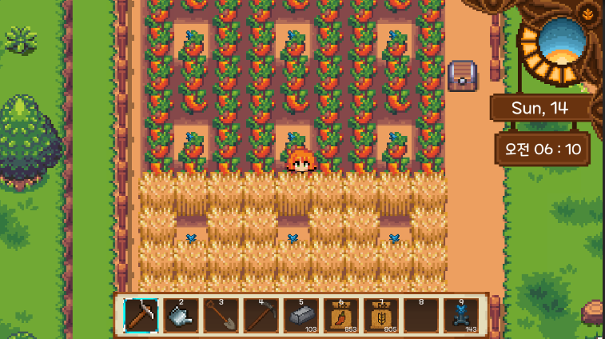

# 2D Farming Game
> 계절에 맞는 작물을 기르고 돈을 벌거나, 산, 광산에서 자원을 채집하여 도움이 되는 물건을 만들어 궁극적으로 농장을 확장시키는 게임
>> 농사를 하고 채집하여 돈을 벌어 농장을 확장시키자

## 특징
- **계절 시스템** : 계절 별 작물 변화
- **수확물 레어리티** : 등급별 판매가 차등
- **창고** : 인벤토리를 더 넓게 사용
- **제련 / 제작** : 얻은 자원을 제련하거나 조합하여 유용한 아이템 제작  

## Control
- 이동 : WASD
- LClick : 퀵슬롯 아이템 사용
- RClick : 상호 작용
- ESC : Pause / UI Close

### 개발 환경
- Unity 2021.3.18f1

#### 사용 Assets
- [Unity Asset Store 이동](https://assetstore.unity.com/packages/2d/environments/2d-cozy-rpg-farming-tilesets-characters-pixelart-full-bundle-212921)
- 픽셀 아이콘 아트 일부 : **생성형 AI를 통한 제작** 

###### 기존 작업하던 Repository에서 새 Repository로 이동
